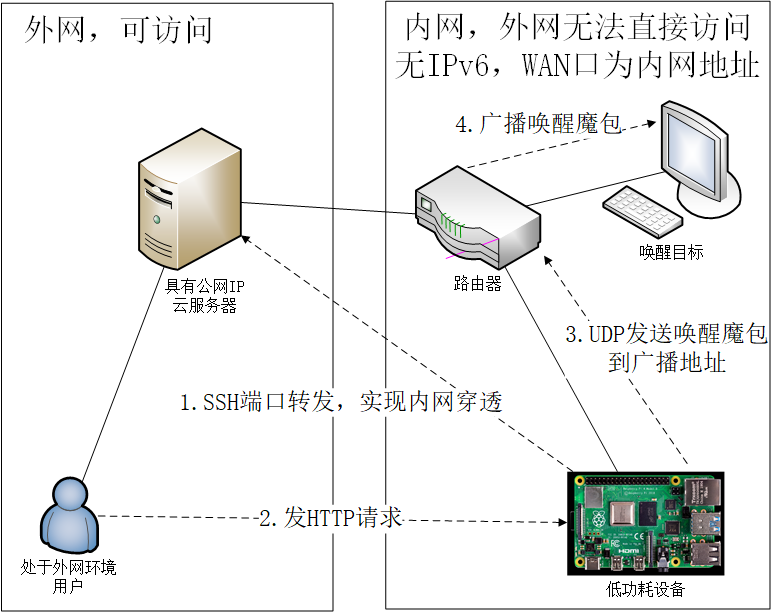

# Wake On LAN \(WOL\)
### 唤醒魔包 远程唤醒

## 1. 为什么要写这个东西

### 现有WOL软件的局限性

### 网络局限性
* 目标机器或网络（运营商）没有IPv6地址
* 运营商没有提供公网IP地址（路由器WAN口获取的IPv4地址为内网地址），无法DDNS

原本我所处的环境有IPv6地址，每个设备都能随时随地访问到（尤其是树莓派，控制其他设备的关键节点）。
现在设备迁移到没有IPv6的环境，需要新的方法实现远程唤醒。

### 节能或应对意外
* 不常用的大功率设备（CPU与显卡能耗较高的台式计算机）
* 台式计算机意外断电后可能无法自动开启

### 所须条件
* 被唤醒设备支持WOL\(S3, S4, S5\)
* 具有公网IP的云服务器
* 低功耗联网设备（[Raspberry Pi](https://www.raspberrypi.org/)）
* SSH

## 2. 实现思路

1. 借助SSH实现内网穿透。将树莓派反向SSH到具备公网IP的云服务器。
2. 本工具走HTTP协议控制，即使用任意可上网的浏览器发一个HTTP请求到本工具。
3. \(Optional，不一定需要唤醒所有设备，或有些设备需要密码唤醒，此处尚未考虑。\)
接收到指令后，本工具会调用系统arp工具扫描所在环境的所有网卡的局域网所有机器的IP地址以及MAC地址，
并为每个MAC地址构建唤醒魔包，UDP广播到所有广播地址，唤醒局域网内的设备。

